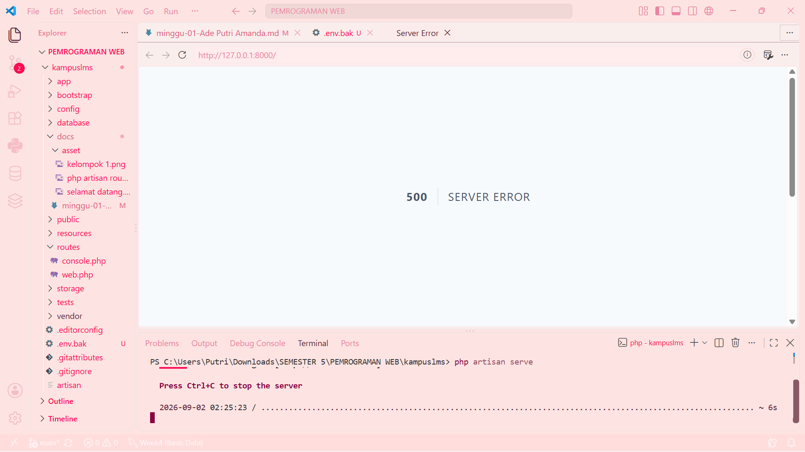
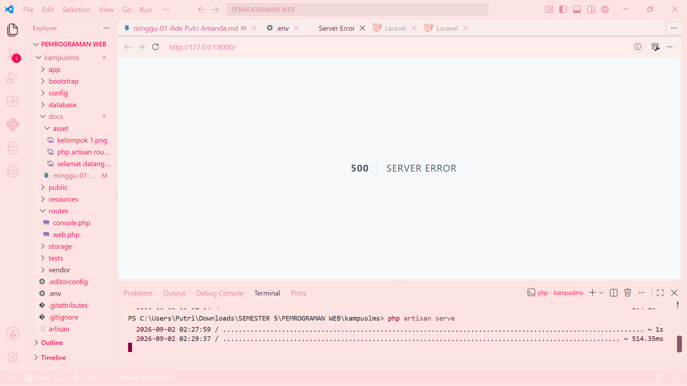

Nama    : Ade Putri Amanda

NIM     : 10241002

# Read → Break → Fix → Build #

## READ — Bedah instalasi Anda sendiri (45 menit)

Setelah instalasi selesai dan halaman selamat datang Laravel muncul, kerjakan tanpa AI:
1. Buka `public/index.php`. Baca dari atas ke bawah. Tulis dalam 3 kalimat apa yang dilakukan berkas ini. 

Jawab: `public/index.php` adalah pintu masuk utama saat website Laravel dibuka. File ini menyiapkan dan menjalankan aplikasi Laravel. Setelah itu, request dari browser diproses oleh Laravel dan menghasilkan response.
   
2. Buka `bootstrap/app.php`. Identifikasi bagian mana yang mengurus route, mana yang mengurus middleware, mana yang mengurus exception.

Jawab: Bagian yang mengurus `route` (mengatur jalur/URL) adalah `withRouting()`, bagian `middleware` (mengatur pengecekan/perantara) adalah `withMiddleware()`, dan bagian `exception` (mengatur penanganan error) adalah `withExceptions()`. 

3. Buka `routes/web.php`. Temukan route yang menghasilkan halaman selamat datang. Ubah teksnya, muat ulang browser, pastikan berubah.

Jawab: 

`<?php`

`use Illuminate\Support\Facades\Route;`

`Route::get('/', function () {`
    `return view('welcome');`
`});`

`<?php`

`use Illuminate\Support\Facades\Route;`

`Route::get('/', function () {`
   ` return ('kelompok 1');`
`});`

4. Jalankan `php artisan route:list`. Cocokkan keluarannya dengan isi `routes/web.php`.
Tulis jawabannya di *docs/minggu-01-catatan.md* di repo kelompok. Setiap anggota menulis catatan sendiri di berkas terpisah *(docs/minggu-01-<nama>.md)*.  

Jawab: 

`route GET /` yang muncul di `route:list` berasal dari `Route::get('/')` pada `routes/web.php`. `Route` tersebut menjalankan `view('welcome')`, sehingga ketika alamat utama website dibuka, Laravel menampilkan halaman *welcome*. 

-------------------------------------------------------------------------------------------------------------------

# BREAK — Rusak dengan sengaja (30 menit)
Lakukan satu per satu, catat pesan errornya, lalu kembalikan:

| # |                   Yang dirusak                 | Prediksi Anda sebelum mencoba | Pesan error sebenarnya |
| - | ---------------------------------------------- | ----------------------------- | ---------------------- |
| 1 | Ganti nama `.env` menjadi `.env.bak`           | Laravel mungkin tidak bisa membaca pengaturan aplikasi karena file .env tidak ada.                      |                     |
| 2 | Kosongkan nilai `APP_KEY` di `.env`            | Terjadi error karena Laravel membutuhkan `APP_KEY` untuk enkripsi.                           |                     |
| 3 | Ubah `DB_DATABASE` menjadi nama yang tidak ada | Laravel tidak bisa menemukan atau terhubung ke database.           |                |
| 4 | Ubah `APP_DEBUG=false` lalu ulangi nomor 3     | Terjadi error, namun detail error tidak ditampilkan dan kemungkinan hanya muncul halaman *500 Server Error*.               |                   |

Nomor 4 adalah yang terpenting. Perhatikan bedanya: dengan `APP_DEBUG=true` Anda melihat seluruh isi konfigurasi dan jejak kode; dengan false Anda hanya melihat halaman 500 kosong. Di server produksi nanti, `APP_DEBUG=true` berarti membocorkan kredensial database Anda kepada siapa pun yang memicu error. Ini akan diuji di minggu 12.

-------------------------------------------------------------------------------------------------------------------