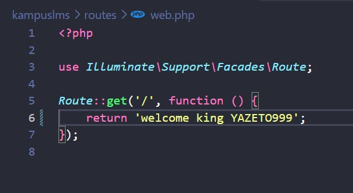
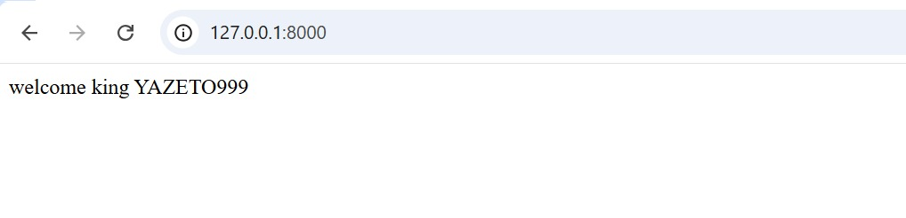
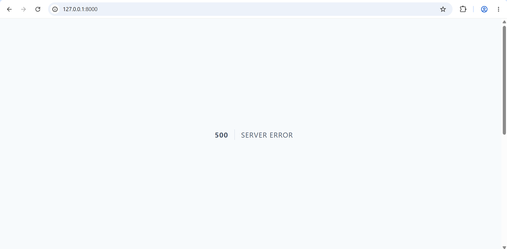

# Laporan Praktikum / Tugas Laravel
 
**Nama:** Andika Putra Pratama
**NIM:** 10241010
 
---

## READ — Bedah Instalasi Anda Sendiri (45 menit)
 
### 1. Buka `public/index.php`. Baca dari atas ke bawah. Tulis dalam 3 kalimat apa yang dilakukan berkas ini.

Tiga proses utama yang dilakukan oleh berkas ini secara berurutan:
 
1. Menentukan apakah aplikasi sedang dalam mode maintenance.
2. Mendaftarkan Composer autoloader.
3. Menangani (mengatasi) permintaan yang masuk.
---

### 2. Buka `bootstrap/app.php`. Identifikasi bagian mana yang mengurus route, mana yang mengurus middleware, mana yang mengurus exception.
 
**Bagian yang mengurus routing (`withRouting`)**
 
```php
->withRouting(
    web: __DIR__.'/../routes/web.php',
    commands: __DIR__.'/../routes/console.php',
    health: '/up',
)
```
 
**Bagian yang mengurus middleware (`withMiddleware`)**
 
```php
->withMiddleware(function (Middleware $middleware) {
    //
})
```
 
**Bagian yang mengurus exception (`withExceptions`)**
 
```php
->withExceptions(function (Exceptions $exceptions) {
    //
})
```
 
---

### 3. Buka `routes/web.php`. Temukan route yang menghasilkan halaman selamat datang. Ubah teksnya, muat ulang browser, pastikan berubah.
 
Di sini saya menghapus bagian `view` beserta isi dalam kurungnya untuk memunculkan kalimat yang saya inginkan.



dan setelah saya jalan kan di website munucl hasil akhir yang sesuai



---
 
### 4. Jalankan `php artisan route:list`. Cocokkan keluarannya dengan isi `routes/web.php`.


1 rute (`/`) didefinisikan secara manual di file `routes/web.php` pada baris ke-5...

---

## BREAK — Rusak dengan sengaja (30 menit)

Lakukan satu per satu, catat pesan errornya, lalu kembalikan:

| # | Yang dirusak | Prediksi Anda sebelum mencoba | Pesan error sebenarnya |
|---|--------------|-------------------------------|------------------------|
| 1 | Ganti nama `.env` menjadi `.env.bak` |halaman akan menampilkan eror karena tidak bisa memebaca file dari `.env` |  |
| 2 | Kosongkan nilai `APP_KEY` di `.env` |halaman yang muncul akan eror dikarenakan kita mengahpus `APP_KEY` nya sehingga laravel tidak enkripsi |  |
| 3 | Ubah `DB_DATABASE` menjadi nama yang tidak ada |akan terjadi eror dikarenakan laravel tidak bisa menemukan database yang telah kita buat |   |
| 4 | Ubah `APP_DEBUG=false`, lalu ulangi nomor 3 |tampilan akan menunjukkan halaman `"500 Server Error"` yang kosong tanpa detail pesan error|  |


