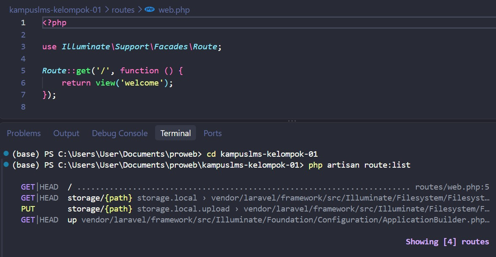

# Laporan Praktikum / Tugas Laravel <br>
# Andika Putra Pratama 10241010

### 1. Buka public/index.php. Baca dari atas ke bawah. Tulis dalam 3 kalimat apa yang dilakukan berkas ini.<br>

Tiga proses utama yang dilakukan oleh berkas ini secara berurutan:<br>
menentukan apakah aplikasi dalam maintenance.mendaftar composer autoloader.mengatasi permintaan

---

### 2. Buka bootstrap/app.php. Identifikasi bagian mana yang mengurus route, mana yang mengurus middleware, mana yang mengurus exception.

* **Bagian yang Mengurus Routing (`withRouting`)**  
  ```php
  ->withRouting(
      web: __DIR__.'/../routes/web.php',
      commands: __DIR__.'/../routes/console.php',
      health: '/up',
  )

 * **Bagian yang Mengurus middleware (`withMiddleware`)**  
  ```php
  ->withMiddleware(function (Middleware $middleware) {
 ```

  * **Bagian yang Mengurus exeception (`withExceptions`)**  
  ```php
  ->withExceptions(function (Exceptions $exceptions) {
 ```

### 3. Buka routes/web.php. Temukan route yang menghasilkan halaman selamat datang. Ubah teksnya, muat ulang browser, pastikan berubah.

disini saya menghapus bagian view dan dalam kurung nya untuk memeunculkan kalimat yang saya ingin kan

dan setelah saya jalan kan di website munucl hasil akhir yang sesuai


### 4. Jalankan php artisan route:list. Cocokkan keluarannya dengan isi routes/web.php.

1 rute (/) diartikan secara manual di file routes/web.php pada baris ke-5