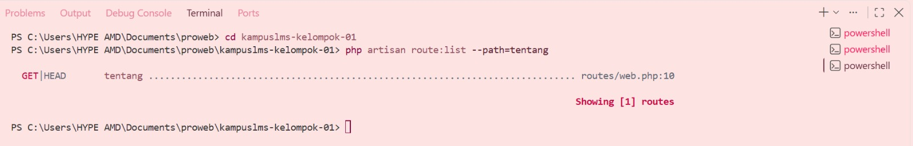

Nama    : Ade Putri Amanda

NIM     : 10241002

# Read → Break → Fix → Build #

## READ — Telusuri satu request penuh (30 menit)

Ambil route `/tentang` yang Anda buat minggu lalu. Tanpa AI, tulis di catatan Anda:

1. Baris mana di `routes/web.php` yang menangkapnya?

Jawab: Terletak pada baris 10 di file `routes/web.php`, yaitu `Route::get('/tentang', [CourseController::class, 'tentang']);` yang mengatur route `/tentang`.

2. Kalau ditangani controller, berkas dan method mana?

Jawab: Route `/tentang` ditangani oleh CourseController, yang terdapat di file `app/Http/Controllers/CourseController.php`, pada method `tentang()`.

3. View mana yang dikembalikan? Di path apa persisnya?

Jawab: View yang dikembalikan adalah `tentang`, yang terdapat pada path `resources/views/tentang.blade.php`.

4. Layout apa yang membungkusnya?

Jawab: Layout yang membungkusnya adalah `Blade Component <x-layout>`. Berkas layout tersebut berada di `resources/views/components/layout.blade.php` dan digunakan di `tentang.blade.php` dengan `<x-layout title="...">...</x-layout>`.

5. Jalankan `php artisan route:list --path=tentang`. Cocok dengan analisis Anda?

Jawab: 

Ya, hasilnya cocok dengan analisis saya karena route `/tentang` berada pada baris *10* di `routes/web.php`, dan hasil `route:list` juga menunjukkan route tersebut.

---------------------------------------------------------------------------------------------------

## BREAK — Delapan kerusakan (40 menit)

Lakukan berurutan. Untuk setiap nomor, **tulis prediksi Anda dulu** sebelum menjalankan.

| **#** | **Yang dirusak** | **Yang Anda pelajari** |
|-------|------------------|------------------------|
| 1 | Ubah `Route::get` menjadi `Route::post` pada route daftar mata kuliah | Method HTTP tidak cocok → 405 |
| 2 | Ubah nama view di `return view(...)` menjadi yang tidak ada | Exception view not found |
| 3 | Hapus `->name('courses.show')`, lalu muat halaman yang memakai `route('courses.show')` | Kenapa nama route wajib |
| 4 | Pindahkan `/courses/{course}` ke ATAS `/courses/create`, lalu buka `/courses/create` | Urutan route menentukan |
| 5 | Ganti `{{ $nama }}` menjadi `{!! $nama !!}`, isi `$nama` dengan `` | **XSS nyata di layar Anda sendiri** |
| 6 | Hapus `@vite(...)` dari layout | Aset tidak termuat |
| 7 | Hentikan `npm run dev` lalu muat ulang halaman | Beda dev server vs build |
| 8 | Panggil `route('courses.show')` tanpa mengirim parameter | Missing required parameter |

Nomor 5 wajib benar-benar dicoba, bukan dibayangkan. Melihat `alert` muncul dari data yang Anda "masukkan sebagai pengguna" mengubah cara Anda memandang setiap keluaran di layar selamanya.

Jawab: 

Setelah `{{ $nama }}` diganti menjadi `{!! $nama !!}`, script yang dimasukkan bisa dijalankan sehingga muncul alert *XSS* karena isi $nama dianggap sebagai kode HTML/JavaScript.

---------------------------------------------------------------------------------------------------

