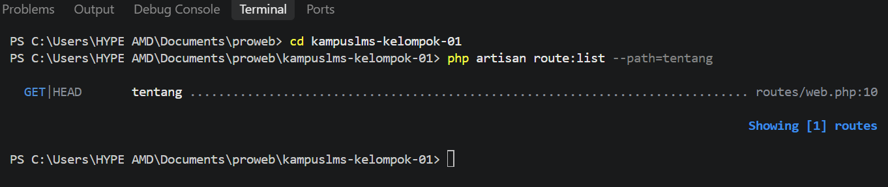

# Minggu 2 - READ

Nama: Adelia Cyntia Renata

NIM: 10241003

1. Soal

    Baris mana di routes/web.php yang menangkapnya?

    Jawaban
    
    Request /tentang ditangkap oleh route:
```php
Route::get('/tentang', function () {
    return view('tentang');
});
```

Route tersebut menggunakan method GET untuk URL /tentang.

2. Soal

    Kalau ditangani controller, berkas dan method mana?

    Jawaban

    /tentang tidak ditangani oleh Controller. Request langsung ditangani oleh closure/function pada routes/web.php, yang kemudian mengembalikan view tentang.

3. Soal

    View mana yang dikembalikan? Di path apa persisnya?

    Jawaban

    View yang dikembalikan adalah tentang, dengan file pada path resources/views/tentang.blade.php.

4. Soal

    Layout apa yang membungkusnya?

    Jawaban

    Tidak ada layout Blade yang membungkus view tentang. File tentang.blade.php berdiri sendiri dan berisi struktur HTML lengkap (<!DOCTYPE html>, <html>, <head>, dan <body>).

5. Soal

    Jalankan php artisan route:list --path=tentang. Cocok dengan analisis Anda?

    Jawaban



    Ya, cocok. Hasil menunjukkan GET|HEAD tentang pada routes/web.php:10, sesuai dengan route yang telah dianalisis.