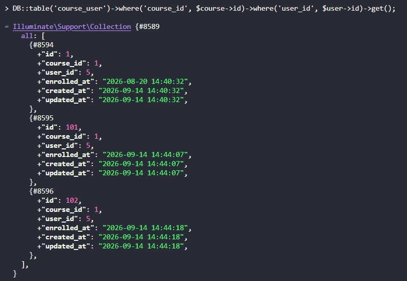
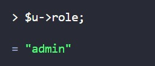
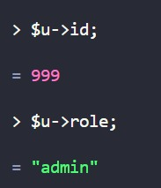

## Tugas 2.3 - READ

Nama: Adelia Isra Ekaputri  
NIM: 10241004

1. Hapus `unique(['course_id','user_id'])` dari `course_user`, lalu daftarkan mahasiswa yang sama dua kali  
Jawaban: Saya menghapus baris `$table->unique(['course_id', 'user_id'])` dari migration `create_course_user_table` lalu menjalankan `php artisan migrate:fresh --seed` untuk menerapkan perubahan tersebut. Setelah itu saya mencoba mendaftarkan mahasiswa yang sama `(user_id = 5)` ke mata kuliah yang sama `(course_id = 1)` sebanyak dua kali secara manual melalui tinker menggunakan `attach()`.

hasil eksekusi Query `DB::table('course_user')->where('course_id', 1)->where('user_id', 5)->get()` menunjukkan 3 baris data untuk pasangan course_id dan user_id yang sama:

Baris id: 1 hasil pendaftaran otomatis dari seeder<br>
Baris id: 101 — hasil percobaan attach() pertama<br>
Baris id: 102 — hasil percobaan attach() kedua
<br>



Tanpa unique, database tidak punya cara menolak data ganda — validasi di aplikasi saja tidak cukup karena insert bisa dilakukan langsung ke database. Constraint ini penting untuk menjaga data enrollment tetap akurat

2. Tambahkan `role` ke `$fillable` model `User`, lalu kirim request pembuatan user dengan `role=admin` lewat form yang tidak punya field role   
Jawaban: Saya menambahkan kolom `role` ke dalam `$fillable` pada model `User` untuk mensimulasikan kondisi di mana properti mass assignment protection tidak diterapkan dengan benar. Setelah itu saya membuat data user baru melalui tinker menggunakan `User::create()` dengan menyisipkan `role => admin`, seolah-olah ini adalah request dari form registrasi publik yang seharusnya hanya berisi `name`, `email`, dan `password`.

```php
$data = ['name' => 'Test User', 'email' => 'test123@test.com', 'password' => 'password', 'role' => 'admin'];
$u = App\Models\User::create($data);
$u->role;
```

hasil eksekusi `$u->role` menunjukkan nilai `"admin"` — padahal form yang disimulasikan tidak pernah menyediakan field `role` sama sekali, sehingga seharusnya user baru default menjadi `mahasiswa`, bukan `admin`.



3. Ganti seluruh `$fillable` dengan `protected $guarded = [];` lalu ulangi nomor 2
Jawaban: Saya mengganti seluruh isi `$fillable` pada model `User` dengan `protected $guarded = [];` untuk mensimulasikan kondisi di mana tidak ada satu pun kolom yang dilindungi dari mass assignment. Setelah itu saya membuat data user baru melalui tinker menggunakan `User::create()` dengan menyisipkan seluruh kolom sekaligus, termasuk `role => admin` dan `id => 999` yang seharusnya tidak pernah bisa ditentukan manual oleh pengguna.

```php
$data = [
    'name' => 'Test Guarded',
    'email' => 'guarded@test.com',
    'password' => 'password',
    'role' => 'admin',
    'id' => 999,
];
$u = App\Models\User::create($data);
$u->id;
$u->role;
```



hasil eksekusi menunjukkan `$u->id` bernilai `999` dan `$u->role` bernilai `"admin"` — keduanya berhasil dipaksa sesuai input, termasuk `id` yang seharusnya auto-increment dan tidak pernah ditentukan secara manual. Ini membuktikan bahwa `$guarded = []` jauh lebih berbahaya dibanding sekadar lupa mengecualikan satu kolom di `$fillable`, karena artinya tidak ada satupun kolom yang dilindungi — bukan hanya `role` yang bisa disusupi, bahkan primary key `id` pun bisa dipaksa oleh pengguna.

4. Kosongkan isi `down()` di satu migrasi, lalu jalankan `php artisan migrate:refresh`  
Jawaban: Pada migration `create_courses_table`, method `down()` sengaja dikosongkan untuk menguji apakah migration dapat di-rollback dengan benar.

Perubahan yang dilakukan:

```php
public function down(): void
{
}
```

Kemudian dijalankan perintah:

```bash
php artisan migrate:refresh
```

Hasilnya, proses rollback migration `courses` terlihat berhasil, tetapi tabel `courses` sebenarnya tidak dihapus karena method `down()` tidak memiliki instruksi untuk menghapus tabel tersebut. Ketika Laravel melanjutkan proses rollback ke migration `users`, muncul error:

```text
SQLSTATE[HY000]: General error: 3730
Cannot drop table 'users' referenced by a foreign key constraint
'courses_lecturer_id_foreign' on table 'courses'.
```

Hal ini terjadi karena tabel `courses` masih ada dan memiliki foreign key `lecturer_id` yang mengarah ke tabel `users`. Akibatnya, MySQL tidak mengizinkan tabel `users` dihapus karena masih digunakan sebagai referensi oleh tabel `courses`.

Dari percobaan ini dapat disimpulkan bahwa method `down()` pada migration harus benar-benar membalikkan perubahan yang dilakukan oleh method `up()`. Migration yang tidak reversible dapat menyebabkan `migrate:refresh` gagal.

5. Ubah `restrictOnDelete` pada `lecturer_id` menjadi `cascadeOnDelete`, lalu hapus satu dosen  
Jawaban: