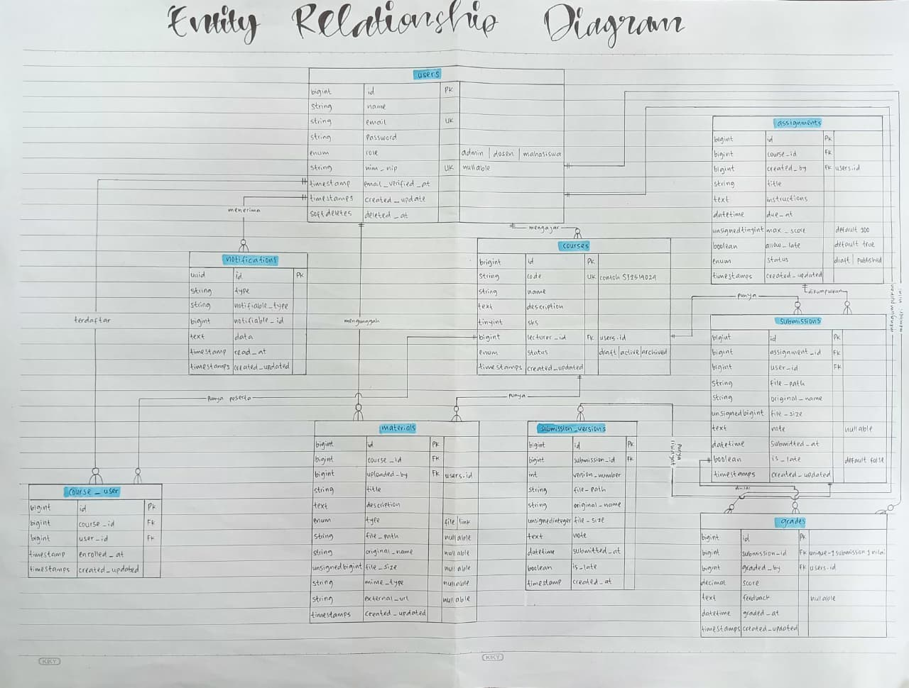

Minggu-03 Kelompok-01

# Read → Break → Fix → Build #

## READ — Baca skema sebelum menulisnya (30 menit)

Sebelum menyentuh kode, kerjakan bersama kelompok:

1. Gambar ulang ERD dari spesifikasi di papan/kertas, tanpa melihat dokumen.

Jawab: 

2. Untuk setiap _foreign key_, tentukan perilaku `onDelete-nya` dan tuliskan alasannya.

Jawab: 
• `courses.lecturer_id → users.id : restrictOnDelete()`
Alasannya, dosen tidak boleh dihapus selama masih menjadi pengampu mata kuliah. Jika menggunakan `cascadeOnDelete()`, penghapusan akun dosen dapat menyebabkan data mata kuliah yang diampunya ikut terhapus. Dengan `restrictOnDelete()`, dosen harus dipindahkan atau mata kuliahnya memiliki pengampu lain terlebih dahulu sebelum akun dapat dihapus.

• `materials.course_id → courses.id : cascadeOnDelete()`
Alasannya, data materi bergantung pada mata kuliah. Jika suatu mata kuliah dihapus, materi yang terkait dengan mata kuliah tersebut juga tidak lagi diperlukan sehingga dapat dihapus secara otomatis.

• `assignments.course_id → courses.id : cascadeOnDelete()`
Alasannya, data tugas bergantung pada mata kuliah. Jika suatu mata kuliah dihapus, tugas yang terkait juga tidak lagi diperlukan sehingga dapat dihapus secara otomatis.

3. Kalau seorang dosen dihapus, apa yang terjadi pada mata kuliahnya? Kenapa dirancang begitu?

Jawab: Kalau seorang dosen dihapus, maka mata kuliahnya tidak ikut terhapus. Namun, proses penghapusan dosen akan ditolak oleh database selama dosen tersebut masih menjadi pengampu mata kuliah. Hal ini terjadi karena menggunakan `restrictOnDelete()`.

Alasannya, karena:

• Bukan `cascadeOnDelete()`, jika dosen dihapus dan mata kuliahnya ikut terhapus, data yang berhubungan dengan mata kuliah tersebut seperti mahasiswa, materi, tugas, dan nilai juga dapat ikut terhapus.

• Bukan `nullOnDelete()`, jika `lecturer_id` dikosongkan, mata kuliah tetap ada tetapi tidak memiliki dosen pengampu. Hal ini dapat membuat data menjadi tidak lengkap.

• Menggunakan `restrictOnDelete()`, admin harus mengganti atau memindahkan dosen pengampu terlebih dahulu. Setelah tidak ada mata kuliah yang menggunakan dosen tersebut, barulah akun dosen dapat dihapus.

Jadi, `restrictOnDelete()` dipilih untuk menjaga agar data mata kuliah tetap aman dan memiliki dosen pengampu yang jelas.

4. Kenapa `grades.submission_id` bersifat _unique_, bukan sekadar index biasa?

Jawab: `grades.submission_id` dibuat _unique_ karena satu _submission_ hanya boleh memiliki satu nilai. _Submission_ berarti satu kali pengumpulan tugas oleh mahasiswa, yaitu satu mahasiswa mengumpulkan satu tugas dengan satu file. Setiap pengumpulan hanya dinilai satu kali oleh dosen, yaitu dosen memberikan skor dan _feedback_, lalu selesai. Jika hanya menggunakan index biasa, _submission_ yang sama masih bisa memiliki lebih dari satu data nilai. Oleh karena itu, _unique_ digunakan agar database mencegah adanya nilai ganda untuk _submission_ yang sama.